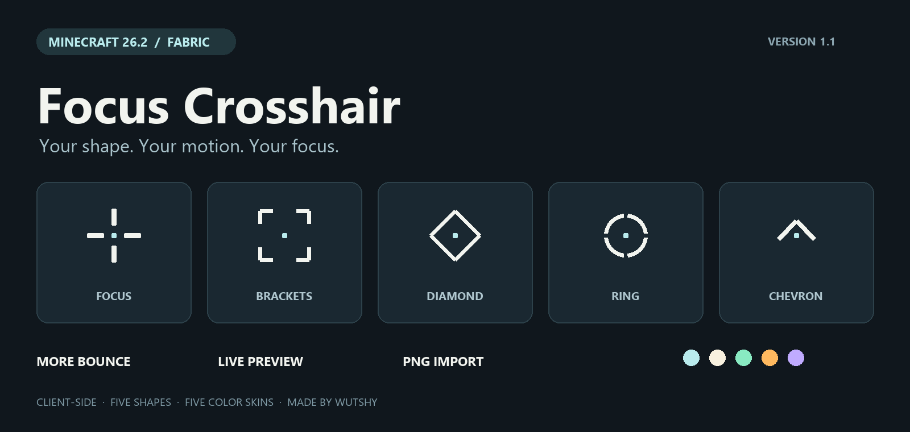
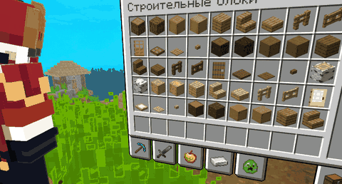

# Focus Crosshair

**Your shape. Your motion. Your focus.**

A customizable, spring-animated crosshair for **Minecraft Java 26.2 / Fabric**. It opens up in the air, tightens over targets, and settles with a visible bounce. Purely visual, client-side, and built around small GUI geometry.

## Make it yours

**Five built-in shapes** — Focus, Brackets, Diamond, Ring and Chevron. Combine them with **five color skins** — Frost, Ivory, Mint, Amber and Lilac — or set your own colors for air, blocks, interactions and entities.

Adjust scale, segment length, line thickness, center gap, center-dot size, outline opacity, transparency and rotation. Each shape shares the same animation system.

## More bounce. Clearer focus.

Version **1.1** has a more expressive default spring response. Tune **bounce**, **animation speed** and **pulse strength** independently.

Set separate size and gap factors for air, blocks, interactable blocks and entities. Optional distance response adds contraction as you approach the currently selected target, then expands the graphic as you move away. Both the effect strength and distance range are configurable.

Only the graphic changes. The mod does not change aim, camera rotation, mouse input, raycasts, reach or hitboxes, and sends no packets.

## A live settings studio

Six sections keep the controls organized: **Styles, Shape, Animation, Focus, Effects and Colors**.

The persistent preview uses the same renderer as the in-game crosshair. Let it cycle through target states, select a particular target, switch between near and far, or trigger attack and hit pulses. Inspect the result at **1× or 3×** while changing settings. Color editing automatically previews the corresponding target state.

Settings apply immediately and save on exit. Use the mouse wheel or page buttons for additional controls. Layout adapts to GUI size, and Reset restores the defaults.

## Import your own crosshair

Choose **Import PNG** in Styles to browse folders and drives, paste a file path, or drag a PNG onto the settings screen.

- Static PNG, up to **512 × 512 pixels** and **1 MiB**; a transparent background is recommended.
- The image is copied to `config/focuscrosshair/custom.png`. The original stays untouched.
- Aspect ratio is preserved. Adjust its displayed size and optionally tint it with the target colors.
- Custom images use the same scale, bounce, rotation and pulse animation. Internal segment spacing and the center dot remain part of your image.
- The texture is loaded once and reused. A missing or unreadable image falls back to Focus; a failed replacement leaves the previous image intact.

[Download a sample transparent PNG](docs/assets/sample-crosshair.png)

## Context effects

- Subtle movement response for sprinting, sneaking, jumping, landing, swimming and elytra flight.
- Attack, interaction and damage pulses; hit confirmation when the server reports damage attributed to you.
- A thin, 16-segment indicator following actual client block-breaking progress.
- Responses to eating, drinking, bows, crossbows, shields and other use actions.
- Optional low-health pulse and idle breathing. Breathing is off by default.

Individual effects can be disabled. The vanilla attack-cooldown indicator is preserved. First-person, spectator, F1 and debug-crosshair visibility are respected; gameplay crosshairs hide in menus and while sleeping.

## Install and configure

Requires **Minecraft 26.2**, **Fabric Loader 0.19.5+**, **Fabric API 0.161.0+26.2** and **Java 25+**. Place `focus-crosshair-1.1.0.jar` in `mods`. No server installation is needed.

**Mod Menu is optional.** Open settings through Mod Menu, or assign **Open Focus Crosshair settings** under Controls → Key Binds → Focus Crosshair. There is also a separate toggle binding; both are unbound by default.

Configuration: `config/focuscrosshair.json`. Existing 1.0 settings are preserved; new options receive the 1.1 defaults. Without the settings screen, edit JSON while the game is closed. Colors use `#AARRGGBB`.

English, German and Russian UI translations are included.

## Gameplay clip



*Author's recording of version 1.0; it does not show the new 1.1 settings studio. Other visual mods and resource packs shown are not included.*

## Compatibility

Compiled against **26.2**. Version 1.1 is build- and logic-tested; it has not been launched in Minecraft. Later 26.x releases, Vulkan and combinations with Sodium, Iris, Spatial GUI or other HUD mods have not been separately verified.

Rendering uses Minecraft GUI abstractions, with no direct OpenGL calls. Another crosshair replacement may take priority. Some modded interactions may use ordinary block focus; hit confirmation depends on server damage events. Visual magnetism uses segment compression rather than moving the aiming center.

[Source code](https://github.com/wuttashi1/focus-crosshair) · [Download](https://github.com/wuttashi1/focus-crosshair/releases/latest) · [Report an issue](https://github.com/wuttashi1/focus-crosshair/issues)

[Русская документация](README.ru.md)

## Build

JDK 25, Gradle Wrapper 9.7.1, Fabric Loom 1.18.2.

```sh
./gradlew clean build
```

Windows: `gradlew.bat clean build`. Production output: `build/libs/focus-crosshair-1.1.0.jar`. Unobfuscated Minecraft 26.2 needs no additional remapping. Tests, development files, documentation and marketing assets are not bundled in the mod JAR. License: MIT.
