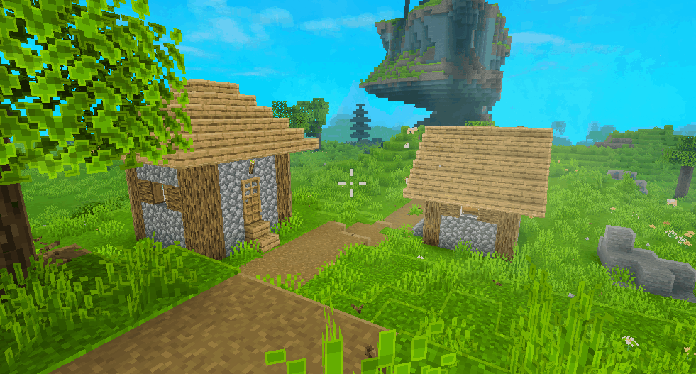

<p align="center"></p>

# Focus Crosshair

**Немного движения. Больше выразительности.**

[Скачать JAR](https://github.com/wuttashi1/focus-crosshair/releases/latest) · [English](README.md) · [Сообщить об ошибке](https://github.com/wuttashi1/focus-crosshair/issues)

Минималистичный анимированный прицел для **Minecraft Java 26.2**, **Fabric** и **Java 25**. Работает только на клиенте.

[](https://github.com/wuttashi1/focus-crosshair/releases/download/v1.0.0/Animation.gif)

*Запись автора. [Полная анимация](https://github.com/wuttashi1/focus-crosshair/releases/download/v1.0.0/Animation.gif) — 118 МиБ. Другие визуальные моды и ресурспаки из записи в комплект не входят.*

## Возможности

- Компактный прицел из четырёх сегментов с отключаемой центральной точкой.
- Плавная пружинная анимация при наведении на блоки, интерактивные блоки и существ.
- Небольшие реакции на движение, спринт, прыжки, приземление, плавание и полёт на элитрах.
- Импульсы атаки, подтверждённого попадания, взаимодействия и получения урона.
- Тонкий сегментированный индикатор фактического прогресса разрушения блока.
- Реакции на еду, питьё, зарядку лука и арбалета, использование щита и других предметов.
- Настройка цветов, размера, прозрачности, толщины линий, зазора и силы анимации.
- Ненавязчивая пульсация при низком здоровье. Дыхание в покое отключено по умолчанию.
- Настройки через необязательный Mod Menu; интерфейс на русском, английском и немецком.

Все эффекты исключительно визуальные. Мод не меняет наведение, поворот камеры, ввод мыши, дальность взаимодействия или хитбоксы и не отправляет пакеты. Центральная точка остаётся на месте.

## Установка

1. Установите Fabric Loader **0.19.5+** и Fabric API **0.161.0+26.2** для Minecraft **26.2**.
2. Используйте Java **25+**.
3. Поместите `focus-crosshair-1.0.0.jar` в папку `mods`.
4. При желании установите Mod Menu **20.0.3**, чтобы менять настройки в игре.

На сервер устанавливать ничего не нужно.

## Настройки

Файл: `config/focuscrosshair.json`. Создаётся при первом запуске. Без Mod Menu редактируйте его при закрытой игре. Цвета задаются в формате `#AARRGGBB`.

В Mod Menu доступны разделы «Общие», «Внешний вид», «Анимация» и «Эффекты». Изменения применяются сразу, сохраняются при выходе; есть сброс к стандартным значениям.

Клавиша переключения находится в настройках управления, в категории **Focus Crosshair**. По умолчанию не назначена. При отключении возвращается предыдущий прицел.

## Совместимость

Собран и запущен на Minecraft **26.2**. В метаданных разрешены более поздние 26.x, но их совместимость отдельно не проверена.

Рисование использует GUI API Minecraft и Fabric, без прямых вызовов OpenGL. Отдельная проверка Vulkan, Sodium, Iris, Spatial GUI и других HUD-модов ещё требуется. Другой мод, заменяющий прицел, может получить приоритет.

Прицел учитывает режим наблюдателя, вид от первого лица, F1 и отладочный прицел, скрывается в меню и во время сна. Стандартный индикатор перезарядки атаки сохраняется.

Визуальный фокус реализован через сжатие сегментов, без смещения точки прицеливания. Интерактивные блоки определяются через API меню и несколько семейств блоков: нестандартные взаимодействия модов могут выглядеть как обычный блок. Подтверждение попадания зависит от событий урона, полученных от сервера.

## Сборка

JDK 25, Gradle Wrapper 9.7.1, Fabric Loom 1.18.2.

```sh
./gradlew clean build
```

Windows: `gradlew.bat clean build`. Готовый мод: `build/libs/focus-crosshair-1.0.0.jar`. Для необфусцированного Minecraft 26.2 дополнительный remap не требуется.

Семь тестов проверяют конфигурацию, восстановление повреждённых файлов, ограничения значений и стабильность пружинной анимации. Лицензия MIT.
